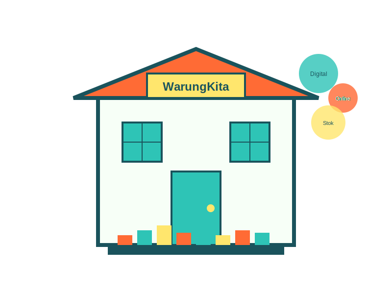

# WarungKita - Digitalisasi Warung Tradisional



WarungKita adalah aplikasi web sederhana untuk membantu pemilik warung tradisional mengelola bisnis mereka secara digital. Aplikasi ini dirancang untuk memudahkan pengelolaan stok, pesanan, promosi, dan analitik bisnis warung.

## Fitur Utama

### 1. Manajemen Stok
- Pencatatan dan pengelolaan stok barang
- Kategorisasi produk (makanan, minuman, sembako, dll)
- Notifikasi stok menipis dan habis
- Import dan export data stok (CSV)
- Pencarian dan filter produk

### 2. Manajemen Pesanan
- Pencatatan pesanan pelanggan
- Pelacakan status pesanan (baru, diproses, siap, selesai, dibatalkan)
- Riwayat pesanan
- Integrasi dengan WhatsApp untuk komunikasi dengan pelanggan

### 3. Manajemen Promosi
- Pembuatan dan pengelolaan promosi
- Template promosi siap pakai
- Penjadwalan promosi dengan tanggal mulai dan selesai
- Berbagi promosi melalui WhatsApp

### 4. Analitik Bisnis
- Dashboard dengan ringkasan penjualan
- Grafik penjualan harian
- Produk terlaris
- Pemantauan stok kritis
- Filter berdasarkan periode waktu

## Teknologi

WarungKita dibangun dengan teknologi web sederhana:
- HTML5
- Tailwind CSS untuk styling
- JavaScript (Vanilla JS)
- Font Awesome untuk ikon
- Chart.js untuk visualisasi data
- LocalStorage untuk penyimpanan data

## Instalasi

WarungKita adalah aplikasi web berbasis client-side yang tidak memerlukan server. Untuk menggunakannya:

1. Clone repositori ini:
   ```
   git clone https://github.com/username/warungkita.git
   ```

2. Buka file `index.html` di browser web Anda

Atau cukup unduh dan ekstrak file ZIP, kemudian buka `index.html`.

## Penggunaan

### Manajemen Stok
1. Buka halaman "Manajemen Stok"
2. Klik "Tambah Barang" untuk menambahkan produk baru
3. Isi detail produk (nama, kategori, harga, stok, stok minimum)
4. Gunakan fitur pencarian dan filter untuk menemukan produk
5. Edit atau hapus produk dengan tombol yang tersedia

### Manajemen Pesanan
1. Buka halaman "Pesanan"
2. Klik "Buat Pesanan" untuk mencatat pesanan baru
3. Isi detail pelanggan dan pilih produk yang dipesan
4. Kelola status pesanan dengan tombol yang tersedia
5. Lihat riwayat pesanan di tab "Riwayat Pesanan"

### Manajemen Promosi
1. Buka halaman "Promosi"
2. Klik "Tambah Promosi" atau gunakan template yang tersedia
3. Isi detail promosi (judul, deskripsi, tanggal mulai dan selesai)
4. Bagikan promosi ke pelanggan melalui WhatsApp

### Analitik
1. Buka halaman "Analitik"
2. Lihat ringkasan penjualan dan stok
3. Gunakan filter periode untuk melihat data dalam rentang waktu tertentu

## Catatan Penting

Aplikasi ini menggunakan LocalStorage untuk menyimpan data. Data akan tersimpan di browser yang digunakan dan tidak akan hilang saat browser ditutup. Namun, data akan hilang jika cache browser dibersihkan. Gunakan fitur export untuk mencadangkan data secara berkala.

## Kontribusi

Kontribusi untuk pengembangan WarungKita sangat diterima. Silakan buat pull request atau laporkan masalah melalui issue tracker.

## Lisensi

WarungKita dilisensikan di bawah [MIT License](LICENSE).